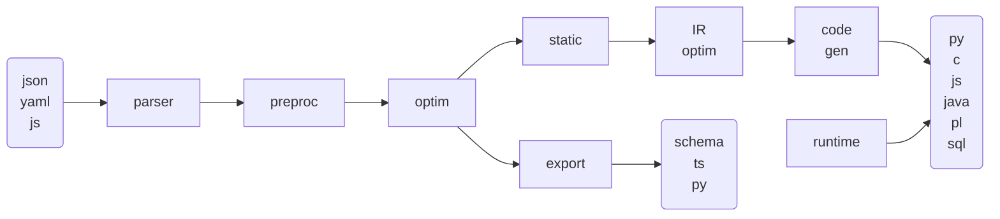

# JSON Model Compiler

This page documents the JSON Model Compiler (JMC), accessible from the `jmc` command.

## Overview

The compiler is composed of 8 parts:

1. Parser from JSON, YAML or JS
2. Preprocessor
3. Model Optimizations
4. Static Compilation to IR
5. Export to TS, JSON Schema or Pydantic
6. IR Optimizations
7. Target Source Code Generation in Python, C, JavaScript, Java, Perl, PL/pgSQL
8. Target Runtime  for each target language

## Parser

Read a model, possibly resolving remote references, from JSON, YAML or JS syntaxes.

## Preprocessor

Apply model transformations (`%`), check references (`$`) and eliminate object merges (`+`).

## Model Optimization

Perform optimizations at the model level, including partial evaluation,
various simplifications and normalizations.

## Static Compiler

Generate a language-agnostic AST (Abstract Syntax Tree) IR (Intermediate Representation) for the evaluator.

## IR Optimization

Optimize the AST, which results in simpler source code.

## Code Generator

Generate actual target source code from the AST.
This includes target-specific optimizations.

## Runtime

Per-language runtimes provide support functions.
